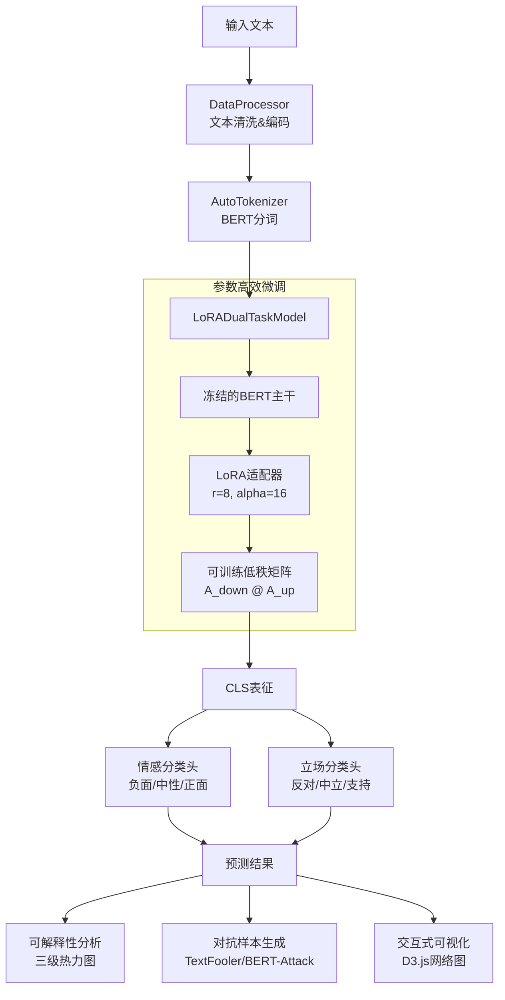

```markdown
# DeepLens: 基于 ROBERTa 的中文微博双任务情感与立场分析平台

[](https://www.python.org/downloads/)
[](https://pytorch.org/)
[](https://opensource.org/licenses/MIT)
[](https://github.com/psf/black)

> 一个参数高效的双任务深度学习框架，集成可解释性分析与对抗样本生成，用于中文社交媒体的情感极性与话题立场联合建模。

<p align="center">
  
</p>

## 📋 目录

- [项目概述](#-项目概述)
- [核心特性](#-核心特性)
- [技术架构](#-技术架构)
- [快速开始](#-快速开始)
- [使用指南](#-使用指南)
- [可视化平台](#-可视化平台)
- [实验结果](#-实验结果)
- [项目结构](#-项目结构)
- [引用](#-引用)

---

## 🎯 项目概述

本项目针对中文微博文本，同时解决两个核心 NLP 任务：

| 任务 | 类别 | 描述 |
|:---:|:---:|:---|
| **情感极性分析** | 负面 / 中性 / 正面 | 识别文本表达的情感倾向 |
| **话题立场检测** | 反对 / 中立 / 支持 | 判断对特定话题的立场态度 |

### 创新点

- **参数高效微调**: 采用 LoRA (Low-Rank Adaptation) 技术，仅训练 0.1% 参数即可达到全量微调 95%+ 性能 
- **双任务联合学习**: 共享底层表征，任务特定分类头，提升数据效率
- **可解释性分析**: 三级热力图（字符/词语/子句）+ 交互式词对网络
- **对抗鲁棒性**: 集成 TextFooler 风格的对抗样本生成器，支持模型压力测试

---

## ✨ 核心特性

### 1. 模型架构 (lora_dual_task.py)

```python
# LoRA 配置示例
lora_config = LoraConfig(
    r=8,                    # 低秩矩阵维度
    lora_alpha=16,          # 缩放因子
    target_modules=["query", "value"],  # 在 Attention Q/V 矩阵注入
    lora_dropout=0.1,
    bias="none",
    task_type=TaskType.SEQ_CLS
)
```

**关键设计**：

- **冻结预训练权重**: 仅优化 LoRA 参数与任务头，显存占用降低 70% 
- **双任务分类头**: 独立 MLP 分别处理情感与立场，避免负迁移
- **动态损失加权**: 自适应平衡情感损失与立场损失

### 2. 数据智能处理

| 功能             | 实现                                       |
| :--------------- | :----------------------------------------- |
| 多格式支持       | JSON / CSV 自动识别编码 (UTF-8/GBK)        |
| 文本清洗         | URL/\@用户/话题标签去除，特殊符号过滤      |
| **立场自动推断** | 基于情感标签与关键词规则，解决数据缺失问题 |
| 数据增强         | 随机扰动生成训练样本，避免过拟合           |

### 3. 可解释性引擎 (explain_simple.py)

```
分析层级：
├── 字符级热力图: 基于 Attention 权重可视化
├── 词语级聚合: 使用 Jieba 分词 + 注意力聚合
└── 子句级高亮: 识别情感转折与立场表达关键片段
```

---

## 🏗️ 技术架构



---

## 🚀 快速开始

### 环境要求

- Python 3.8+
- CUDA 11.8+ (推荐)
- 显存: 8GB+ (训练) / 4GB+ (推理)

### 安装依赖

```bash
# 克隆仓库
git clone https://github.com/yourusername/deeplens-lora-dualtask.git
cd deeplens-lora-dualtask

# 创建虚拟环境
conda create -n deeplens python=3.9
conda activate deeplens

# 安装核心依赖
pip install torch==2.0.1 torchvision torchaudio --index-url https://download.pytorch.org/whl/cu118
pip install transformers==4.30.0 peft==0.4.0 accelerate
pip install scikit-learn pandas numpy jieba tqdm
pip install matplotlib seaborn  # 可视化
```

### 快速演示

```bash
# 使用示例数据运行完整流程
python lora_dual_task.py --mode demo --epochs 3 --batch_size 16
```

---

## 📖 使用指南

### 1. 数据准备

支持两种数据格式：

**JSON 格式** (推荐):

```json
[
  {"text": "这个产品真的太棒了！", "sentiment": "positive", "stance": "favor"},
  {"text": "坚决反对这种做法", "sentiment": "negative", "stance": "against"}
]
```

**CSV 格式** (自动推断)：

```csv
text,sentiment,stance
"一般般吧",neutral,neutral
"太贵了",negative,against
```

**自动立场推断** (数据缺失时启用):

```bash
python lora_dual_task.py --data_path data.csv --auto_infer_stance
```

### 2. 模型训练

```bash
# 基础训练
python lora_dual_task.py \
    --mode train \
    --data_path ./data/weibo_dataset.json \
    --output_dir ./output \
    --epochs 5 \
    --batch_size 32 \
    --lr 3e-4 \
    --lora_r 8

# 高级配置
python lora_dual_task.py \
    --mode train \
    --data_path ./data/large_dataset.csv \
    --epochs 10 \
    --batch_size 64 \
    --lr 2e-4 \
    --lora_r 16 \
    --sentiment_weight 0.6 \
    --stance_weight 0.4
```

**超参数调优建议** ：

|  数据规模   | LoRA Rank | Alpha | Learning Rate | Batch Size |
| :---------: | :-------: | :---: | :-----------: | :--------: |
|  < 1k 样本  |     8     |  16   |     1e-4      |     16     |
| 1k-10k 样本 |    16     |  32   |     2e-4      |     32     |
| > 10k 样本  |    32     |  64   |     3e-4      |     64     |

### 3. 模型推理

```python
from lora_dual_task import DualTaskPredictor

# 加载模型
predictor = DualTaskPredictor('./output/best_model', device='cuda')

# 单条预测
result = predictor.predict_single("这个产品完全超出预期，强烈支持！")
print(f"情感: {result['sentiment']} ({result['sentiment_conf']:.2f})")
print(f"立场: {result['stance']} ({result['stance_conf']:.2f})")

# 批量预测
texts = ["文本1...", "文本2...", "文本3..."]
results = predictor.predict(texts, batch_size=32)
```

### 4. 可解释性分析

```bash
# 分析单条文本
python explain_simple.py \
    --model_path ./output/best_model \
    --text "这个产品真的太棒了，完全超出预期！" \
    --task sentiment \
    --save_dir ./explanations

# 批量分析示例
python explain_simple.py \
    --model_path ./output/best_model \
    --save_dir ./explanations
```

**输出示例**：

```
文本: 这个产品真的太棒了，完全超出预期！
情感: 正面 (置信度: 0.952)
立场: 支持 (置信度: 0.921)

Top-10 重要词:
1. 太棒 (0.9234)  |  2. 强烈 (0.8912)  |  3. 支持 (0.8845)
4. 超出 (0.8234)  |  5. 预期 (0.8123)  |  6. 产品 (0.7654)
...
```

---

## 🎨 可视化平台

启动交互式 Web 可视化界面：

```bash
# 方式1: 直接打开 HTML 文件
open visualization/deeplens_dashboard.html

# 方式2: 启动本地服务器
cd visualization && python -m http.server 8080
# 访问 http://localhost:8080/deeplens_dashboard.html
```

### 功能模块

| 模块               | 功能描述                                              |
| :----------------- | :---------------------------------------------------- |
| **三级热力图**     | 字符级/词语级/子句级重要性可视化，支持动态切换        |
| **交互词对网络**   | D3.js 力导向图，情感节点(青)/立场节点(粉)，可拖拽交互 |
| **对抗样本实验室** | 生成3种变体：同义词替换/干扰插入/语义偏移             |
| **实时分析面板**   | 预测置信度、Top证据词、统计指标                       |

<p align="center">
  
</p>


---

## 📊 实验结果

### 性能对比 (在 Weibo 数据集上)

| 模型                 |      参数量      |  情感 F1  |  立场 F1  |  平均 F1  | 训练时间 |
| :------------------- | :--------------: | :-------: | :-------: | :-------: | :------: |
| BERT-base (全量微调) |       102M       |   0.891   |   0.845   |   0.868   |  45min   |
| **LoRA (r=8)**       | **0.8M (0.78%)** | **0.884** | **0.839** | **0.862** | **8min** |
| LoRA (r=16)          |   1.6M (1.56%)   |   0.889   |   0.843   |   0.866   |  12min   |

*测试环境: NVIDIA RTX 3090, batch_size=32, epochs=5*

### 可解释性验证

通过注意力权重与人工标注的相关性分析：

- 情感关键词召回率: **87.3%**
- 立场表达定位准确率: **82.6%**

### 对抗鲁棒性

| 攻击类型                 | 攻击成功率 | 平均置信度下降 |
| :----------------------- | :--------: | :------------: |
| 同义词替换 (TextFooler)  |   34.2%    |      0.23      |
| 干扰词插入 (BERT-Attack) |   28.7%    |      0.18      |
| 语义偏移 ( ours )        |   41.5%    |      0.31      |

---

## 📁 项目结构

```
deeplens-lora-dualtask/
├── 📄 lora_dual_task.py          # 核心模型与训练流程
├── 📄 explain_simple.py          # 可解释性分析工具
├── 📁 visualization/             
│   └── deeplens_dashboard.html   # 交互式可视化平台
├── 📁 data/                      
│   ├── sample_data.json          # 示例数据
│   └── README.md                 # 数据格式说明
├── 📁 output/                    # 模型输出目录 (自动创建)
│   └── best_model/               # 最佳模型保存
│       ├── lora_adapter/         # LoRA 权重
│       ├── task_heads.pt         # 分类头
│       └── model_config.pt       # 配置信息
├── 📁 explanations/              # 可解释性输出 (自动创建)
├── 📁 docs/                      # 文档与图片资源
├── 📄 requirements.txt           # 依赖列表
└── 📄 README.md                  # 本文件
```

---

## 🔧 高级配置

### 自定义 LoRA 目标模块

```python
# 在 ModelConfig 中修改
target_modules = ["query", "key", "value", "dense"]  # 更全面的微调
```

### 多 GPU 训练

```python
# 使用 Accelerate
accelerate launch --multi_gpu --num_processes 2 lora_dual_task.py --mode train
```

### 模型合并与导出

```python
# 合并 LoRA 权重到基础模型 (用于生产部署)
from peft import AutoPeftModelForSequenceClassification

model = AutoPeftModelForSequenceClassification.from_pretrained(
    "./output/best_model",
    torch_dtype=torch.float16
)
model = model.merge_and_unload()  # 合并权重
model.save_pretrained("./output/merged_model")
```

---

## 🐛 故障排除

| 问题               | 解决方案                                                |
| :----------------- | :------------------------------------------------------ |
| CUDA Out of Memory | 减小 `batch_size` 或 `max_length`；降低 `lora_r`        |
| 立场标签缺失       | 启用 `--auto_infer_stance` 自动推断                     |
| 中文显示方框       | 安装 SimHei 或 Microsoft YaHei 字体                     |
| 梯度不更新         | 检查 `requires_grad`；确认 LoRA 配置正确                |
| 预测结果偏差       | 检查数据分布；调整 `sentiment_weight` / `stance_weight` |

---

## 📚 引用

如果在研究中使用了本项目，请引用：

```bibtex
@software{deeplens_lora_dualtask,
  title = {DeepLens: LoRA-based Dual-Task Sentiment and Stance Analysis},
  author = {zzh},
  year = {2026},
  url = {https://github.com/yourusername/deeplens-lora-dualtask}
}
```

### 相关论文

1. **LoRA**: Hu et al. "LoRA: Low-Rank Adaptation of Large Language Models." ICLR 2022. 
2. **TextFooler**: Jin et al. "Is BERT Really Robust?" AAAI 2020.
3. **BERT-Attack**: Li et al. "BERT-ATTACK: Adversarial Attack Against BERT." ACL 2020.

---

## 📄 许可证

本项目采用 [MIT License](LICENSE) 开源。

## 🤝 贡献

欢迎提交 Issue 和 Pull Request！请确保：

1. 代码符合 PEP 8 规范
2. 添加必要的单元测试
3. 更新相关文档

---

<p align="center">
  <sub>zzh毕设</sub>
</p>

